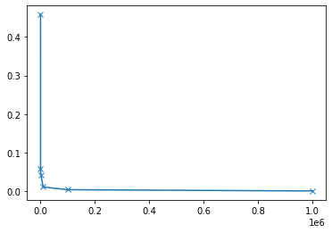

# Scientific Python Homework

## Instructor: Dr. Jack S. Hale

### Instructions

Homework should be submitted by Friday 28th November 2025 end-of-day.

Please submit your homework by saving files with name
`LASTNAME_Firstname_Scientific_Python.ipynb` and
`LASTNAME_Firstname_monte_carlo.py`. Send an [email to
jack.hale@uni.lu](mailto:jack.hale@uni.lu?subject=Scientific Python Homework
2025) with the subject `Scientific Python Homework 2025` with the two files as
email attachments. It is mandatory to complete the homework in order to receive
the ECTS credits or the certification with "completed homework" mark.

### How to ask a question

For both technical and non-technical questions about the homework please ask on
the [Etherpad](https://pad.carpentries.org/spul2025). *Please do not post full
solutions on the Etherpad. Small snippets of code to explain your question are
OK though!*

### Collaboration

Please make use of a search engine, the internet, and the knowledge of your
colleagues when completing the homework, but write your answers in your own
words and code. It is expected that you use the documentation to help you
answer the questions (`np.lookfor`, [Pandas](https://pandas.org),
[numpy](https://numpy.org/), [matplotlib](https://matplotlib.org) etc.).

### Short questions

This section should be answered on Google Colab and saved to a file
`LASTNAME_Firstname_Scientific_Python.ipynb`.

For the text answers try a [Markdown Cell](https://www.markdownguide.org) by
using the *Text +* button on Google Colab.

1. Read and execute the `matplotlib` sections in the [Jake Vanderplas book
   (04.08-04.12)](https://github.com/jakevdp/PythonDataScienceHandbook/tree/master/notebooks) Write
   a short (a few lines summary) of each section. Show three example plots in total.

2. Explain and demonstrate 8 (or more!) pieces of ‘good practice’ when
   programming in Python. To illustrate each example, write a short ‘bad
   example’, and an ‘improved example’ showing the application of best
   practice.

3. Explain the main differences between a list and a dictionary.

4. Write a short function that demonstrates the use of `*args`, default
   arguments and `**kwargs`. Explain how using these three tools can improve
   the design of your functions.

5. Why should you prefer using iterators over counting variables and indexing
   into list or array elements?

6. Write three routines for performing a dense [Matrix-Vector
   multiplication](https://en.wikipedia.org/wiki/Matrix_multiplication) using:
    1. Python list of lists as the main data structures (use loops over
       entities). In this case, it is easier to write this algorithm with
       columns indexed first [column-major
       ordering](https://en.wikipedia.org/wiki/Row-_and_column-major_order)).
    2. Numpy arrays as the main data structures (use loops over the entries).
    3. Using Numpy’s built in matrix multiplication A@b.

   Use `assert` and `np.allclose` to make sure the answers are close to the
   answer provided by numpy's implementation. Time each of the above methods
   (use the `%timeit` magic within a cell to time execution). You will need to
   use a large linear system e.g. of at least dimension 1000 to get accurate
   timings. Comment on the results.

### `numpy` long question

Instead of using a notebook, please attempt this exercise by running Python
from the terminal `python3 LASTNAME_Firstname_monte_carlo.py` and edit the code
using your preferred text editor (avoid Notepad on Windows, try Notepad++ or
Sublime).

On Mac, Linux and Windows, I recommend the [Anaconda Python
distribution](https://www.anaconda.com/products/distribution) but you are free
to use any reasonably modern distribution of Python (Linux packages, Homebrew
etc.).

The completed code for this exercise should be submitted as a Python script
`LASTNAME_Firstname_monte_carlo.py`. 

Please read and follow the PEP8 style guide when writing your code. Most
formatting issues should be taken care of by the code formatter in step 8., but
things like good variable naming cannot be automated.

Beginning with the basic code in the notebook cell below:

1. Add comments throughout your code following the advice
   [here](https://stackoverflow.blog/2021/07/05/best-practices-for-writing-code-comments/)
2. Add a documentation string to the function `estimate_pi`.
3. Remove the call to `np.sqrt`. Explain why you can do this in a comment.
4. Plot the error on a log-log plot instead of a linear plot.
5. In log-log space the error vs N does not form a straight line. If you run
   the code again, you will see that you get a different line. Why? 
6. To solve this 'problem', you instead need to compute the mean error of the
   estimator, that is, estimate the error M times (e.g. 50 times) for each N,
   and then compute the sample mean of the error from the M estimates. Add a 
   a second for loop to perform this operation.
6. Calculate the slope of the mean error vs N in log-log space using the
   functionality in `numpy.Polynomial`.
   You should have a slope of around -0.5. Does this conform with the expected
   slope for the theoretical convergence rate for Monte Carlo estimation?
7. Add axis labels and a title to your plot.
8. Put your code through an automatic code formatter e.g. `ruff format
   LASTNAME_Firstname_monte_carlo.py` before submitting it. You can install
   ruff using `pip install ruff`.

```python
import numpy as np
import matplotlib.pyplot as plt

def estimate_pi(N):
    darts = np.random.uniform(size=(N, 2))

    dist = np.sqrt(darts[:, 0]**2 + darts[:, 1]**2)

    inside_outside = dist < 1.0
    num_inside = np.count_nonzero(inside_outside)

    estimate_pi = 4.0*num_inside/N
    return estimate_pi

Ns = np.array([10, 100, 1000, 10000, 100000, 1000000])
errors = np.zeros_like(Ns, dtype=np.float64)
for i, N in enumerate(Ns):
    errors[i] = np.abs(estimate_pi(N) - np.pi)

plt.plot(Ns, errors, '-x')
plt.show()
```

